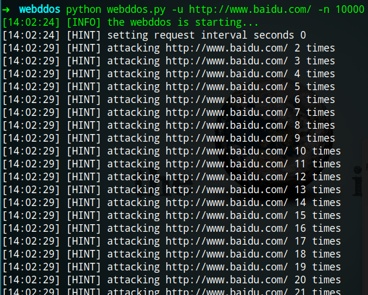

# Webddos
一个实验用的CC DOS攻击程序，仅使用了多线程，http发包部分参考[GoldenEye](https://github.com/jseidl/GoldenEye) 。

## Usage
	python webddos.py -h
	usage: webddos.py [-h] [-v] [-i] [-m] [-w] [-t] [-n] [-u] [-s]
	
	optional arguments:
	  -h, --help       show this help message and exit
	  -v, --verbose    more verbose output,default disabled
	  -i, --info       show developer information of webddos
	  -m , --method    specify request method,get or post (default GET)
	  -w , --wait      specify request interval seconds,0~3600 (default 0)
	  -t , --timeout   timeout to parse web page (default 5)
	  -n , --number    specify the max number of request parameters
	  -u , --url       target url to attack
	  -s , --server    specify web server name(apache,nginx,iis),default 1000
	
	use examples:
	        python webddos.py -u http://example.com/index.php -n 1000
	        python webddos.py -u http://example.com/index.php -m get -n 1000 -v
	

